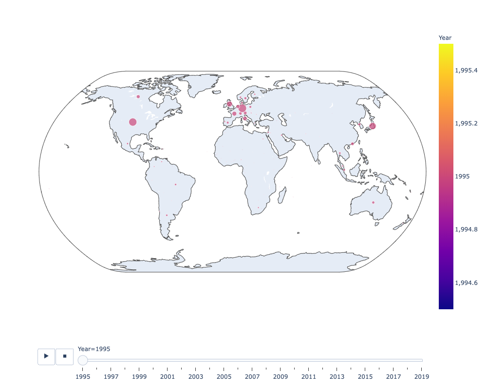
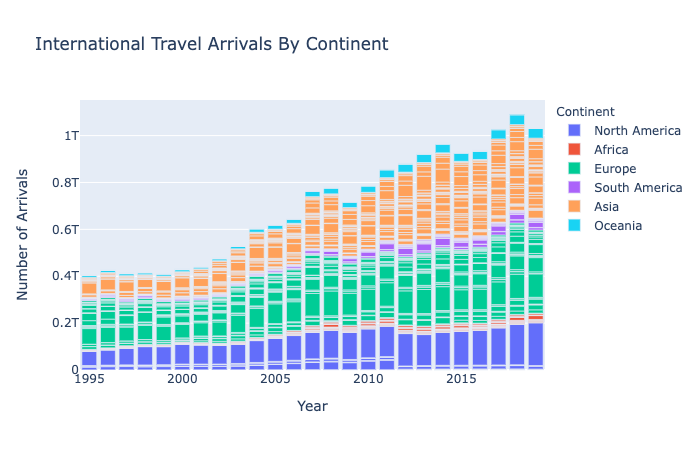
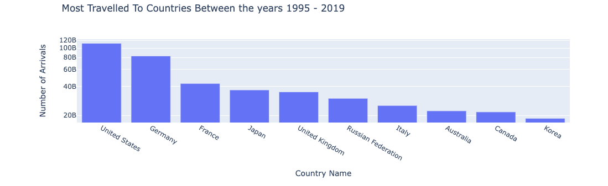
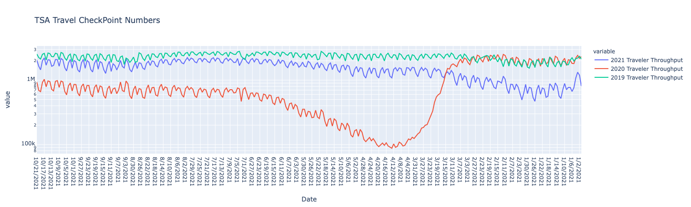
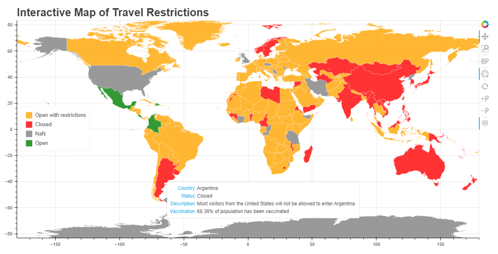
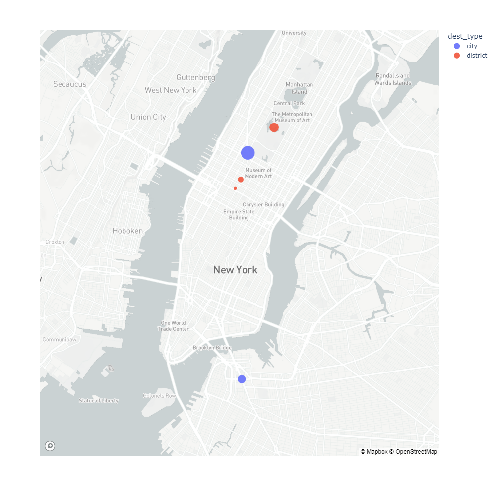
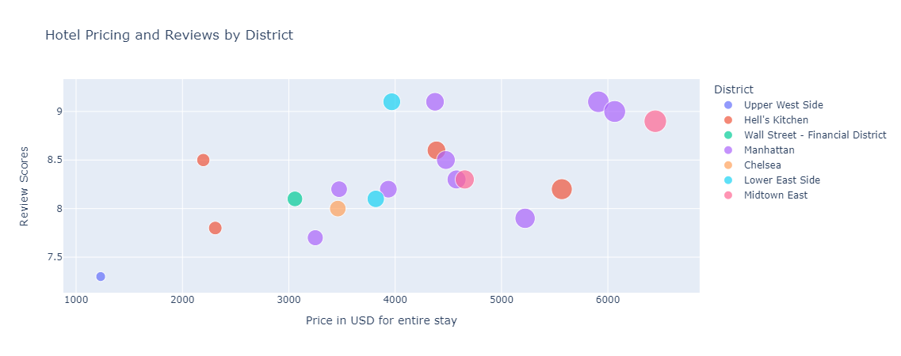
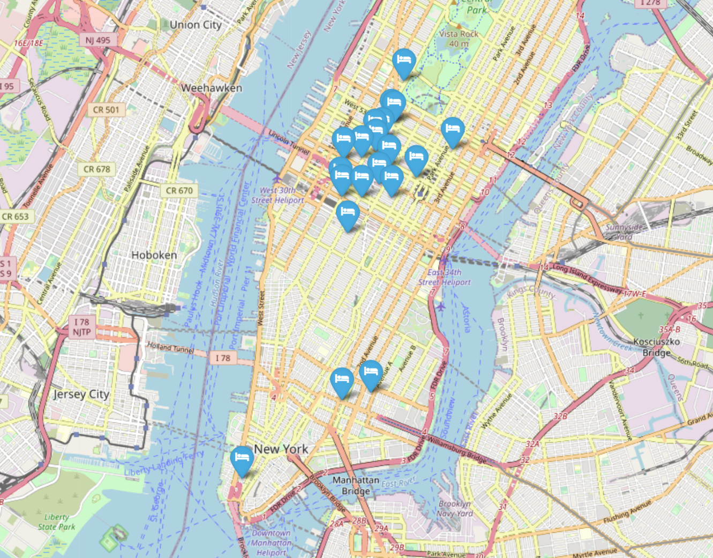

# PyTravel: Go, Find, Explore

*Photo by Andrew Neel from Pexels*

 

## Welcome to PyTravel, the FinTech-Powered Travel Agency

PyTravel's main objectives are:

* Analyze tourism data to report trends to the marketing team

* Provide clients with flight and hotel options for their next trip

* Provide up-to-date information on COVID-19 travel restrictions

You will find three directories that address each of these objectives if you follow the path:

> `resources/exploration_cleanup_notebooks/`

 

# Contents

Here's a breakdown of the solutions we provide.

## Tourism Analysis

* What has been the trend of international travel?

* Where in the world do tourists travel the most? Continent?

* Which countries did the most tourists travel to between the years 1995 - 2019?

* How does 2020 travel compare to travel in 2019 and thus far in 2021?

 

## COVID-19 Restrictions

* How has COVID-19 affected international travel from the United States?
* What are some of the travel restrictions that have been implemented due to COVID-19?

 

## Trip Planner

The Trip Planner Notebook generates two text files for flight and hotel quotes, and a client-focused dashboard.

### Flight Search with SkyScanner API

*What are the flight options available for the client's intended destination?*

> * A text file named `flights_output.txt` with detailed flight quote(s) information
> * A bar plot with price for any and all quotes retrieved by the API

### Hotel Search with Booking com API

*What is the hotel availability in the destination of interest?*

> * A scatter plot map with the number of hotels in a given city

*What are some of the hotel options? How do these compare to each other in price and quality?*

> * A text file named `hotels_output.txt` with detailed information for 20 hotels in the area

> * A scatter plot of pricing vs. review scores for hotels in the location of choice

### Folium Library

*How can we compare hotel locations with other points of reference?*

> * An interactive map with location, price and review score data for 20 hotels

---

#### Marcela Castaño, Monique Ferguson and Frank Lau
